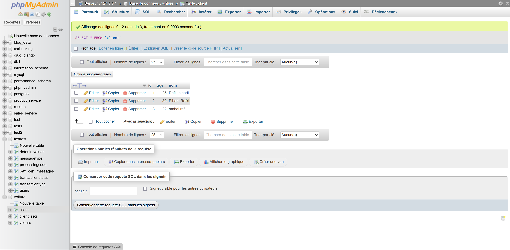

# Projet d'Architecture Micro-service

Ce projet vise à développer une compréhension approfondie de l'architecture micro-service à travers plusieurs axes centraux.

## Objectif du TP

Le but de ce TP est d'acquérir des compétences dans les domaines suivants :
- Création et enregistrement de micro-services
- Connexion à une base de données MySql
- Mise en place d'un micro-service Gateway
- Implémentation d'une communication synchrone entre les micro-services en utilisant l'outil OPENFEIGN

## Architecture Micro-service

Nous adoptons une architecture basée sur les microservices, caractérisée par la décomposition d'une application en de petits services indépendants. Les microservices clients sont des entités autonomes qui interagissent pour fournir une fonctionnalité complète. L'API Gateway agit en tant que point d'entrée centralisé, simplifiant la gestion des requêtes en dirigeant le trafic vers les microservices appropriés. Le serveur de découverte Eureka joue un rôle crucial en permettant à chaque microservice de s'enregistrer dynamiquement, formant ainsi un annuaire décentralisé des services disponibles.

  

